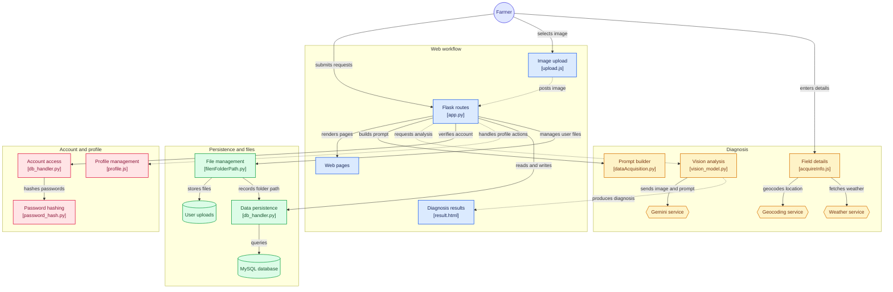

# Kisan-Mitr

```mermaid
%% Generated by https://gitdiagram.com/ashutoshdebug/kisan-mitr
flowchart TD

subgraph group_web["Web workflow"]
  node_routes["Flask routes<br/>[app.py]"]
  node_webpages["Web pages"]
  node_upload["Image upload<br/>[upload.js]"]
  node_results["Diagnosis results<br/>[result.html]"]
end

subgraph group_diagnosis["Diagnosis"]
  node_fieldform["Field details<br/>[acquireInfo.js]"]
  node_prompt["Prompt builder<br/>[dataAcquisition.py]"]
  node_vision["Vision analysis<br/>[vision_model.py]"]
  node_gemini{{"Gemini service"}}
  node_geocoder{{"Geocoding service"}}
  node_weather{{"Weather service"}}
end

subgraph group_storage["Persistence and files"]
  node_dbhandler["Data persistence<br/>[db_handler.py]"]
  node_mysql[("MySQL database")]
  node_filepaths["File management<br/>[filenFolderPath.py]"]
  node_userfiles[("User uploads")]
end

subgraph group_profile["Account and profile"]
  node_auth["Account access<br/>[db_handler.py]"]
  node_password["Password hashing<br/>[password_hash.py]"]
  node_profileui["Profile management<br/>[profile.js]"]
end

node_farmer(("Farmer"))

node_farmer -->|"submits requests"| node_routes
node_routes -->|"renders pages"| node_webpages
node_farmer -->|"selects image"| node_upload
node_upload -.->|"posts image"| node_routes
node_farmer -->|"enters details"| node_fieldform
node_fieldform -->|"geocodes location"| node_geocoder
node_fieldform -->|"fetches weather"| node_weather
node_routes -->|"builds prompt"| node_prompt
node_routes -.->|"requests analysis"| node_vision
node_vision -->|"sends image and prompt"| node_gemini
node_vision -.->|"produces diagnosis"| node_results
node_routes -->|"verifies account"| node_auth
node_auth -->|"hashes passwords"| node_password
node_routes -.->|"handles profile actions"| node_profileui
node_routes -->|"reads and writes"| node_dbhandler
node_dbhandler -->|"queries"| node_mysql
node_routes -->|"manages user files"| node_filepaths
node_filepaths -->|"stores files"| node_userfiles
node_filepaths -->|"records folder path"| node_dbhandler

click node_routes "https://github.com/ashutoshdebug/kisan-mitr/blob/main/app.py"
click node_webpages "https://github.com/ashutoshdebug/kisan-mitr/tree/main/templates"
click node_upload "https://github.com/ashutoshdebug/kisan-mitr/blob/main/static/js/upload.js"
click node_fieldform "https://github.com/ashutoshdebug/kisan-mitr/blob/main/static/js/acquireInfo.js"
click node_prompt "https://github.com/ashutoshdebug/kisan-mitr/blob/main/engine/dataAcquisition.py"
click node_vision "https://github.com/ashutoshdebug/kisan-mitr/blob/main/engine/vision_model.py"
click node_results "https://github.com/ashutoshdebug/kisan-mitr/blob/main/templates/result.html"
click node_auth "https://github.com/ashutoshdebug/kisan-mitr/blob/main/database/db_handler.py"
click node_password "https://github.com/ashutoshdebug/kisan-mitr/blob/main/utils/password_hash.py"
click node_profileui "https://github.com/ashutoshdebug/kisan-mitr/blob/main/static/js/profile.js"
click node_dbhandler "https://github.com/ashutoshdebug/kisan-mitr/blob/main/database/db_handler.py"
click node_filepaths "https://github.com/ashutoshdebug/kisan-mitr/blob/main/utils/filenFolderPath.py"
click node_userfiles "https://github.com/ashutoshdebug/kisan-mitr/tree/main/static/uploads/database"

classDef toneNeutral fill:#f8fafc,stroke:#334155,stroke-width:1.5px,color:#0f172a
classDef toneBlue fill:#dbeafe,stroke:#2563eb,stroke-width:1.5px,color:#172554
classDef toneAmber fill:#fef3c7,stroke:#d97706,stroke-width:1.5px,color:#78350f
classDef toneMint fill:#dcfce7,stroke:#16a34a,stroke-width:1.5px,color:#14532d
classDef toneRose fill:#ffe4e6,stroke:#e11d48,stroke-width:1.5px,color:#881337
classDef toneIndigo fill:#e0e7ff,stroke:#4f46e5,stroke-width:1.5px,color:#312e81
classDef toneTeal fill:#ccfbf1,stroke:#0f766e,stroke-width:1.5px,color:#134e4a
class node_routes,node_webpages,node_upload,node_results toneBlue
class node_fieldform,node_prompt,node_vision,node_gemini,node_geocoder,node_weather toneAmber
class node_dbhandler,node_mysql,node_filepaths,node_userfiles toneMint
class node_auth,node_password,node_profileui toneRose
class node_farmer toneIndigo
```