# Kisan-Mitr

```mermaid
%% Generated by https://gitdiagram.com/ashutoshdebug/kisan-mitr
flowchart TD

subgraph group_web["Web workflow"]
  node_flask["Flask app<br/>[app.py]"]
  node_upload_route["Image upload<br/>[upload.py]"]
  node_acquire_route["Field details<br/>[acquire.py]"]
  node_result_route["Diagnosis results<br/>[results.py]"]
  node_web_pages["Web pages"]
  node_upload_ui["Upload interface<br/>[upload.js]"]
  node_field_ui["Field form<br/>[acquireInfo.js]"]
  node_landing_route["Landing page<br/>[landing.py]"]
  node_motive_route["Motive page<br/>[motivePage.py]"]
  node_notfound_route["Not found<br/>[pageNotFound.py]"]
end

subgraph group_diagnosis["Crop diagnosis"]
  node_prompt["Prompt builder<br/>[dataAcquisition.py]"]
  node_vision["Image analysis<br/>[vision_model.py]"]
  node_gemini{{"Gemini service"}}
  node_geocoder{{"Geocoding service"}}
  node_weather{{"Weather service"}}
end

subgraph group_accounts["Accounts and profile"]
  node_login_route["Login and signup<br/>[login.py]"]
  node_profile_route["Profile management<br/>[profile.py]"]
  node_logout_route["Logout<br/>[logout.py]"]
  node_password["Password hashing<br/>[password_hash.py]"]
end

subgraph group_persistence["Persistence and files"]
  node_db_handler["Database handler<br/>[db_handler.py]"]
  node_mysql[("MySQL database")]
  node_file_manager["User file manager<br/>[filenFolderPath.py]"]
  node_user_files[("User uploads")]
end

node_farmer(("Farmer"))

node_farmer -->|"uses app"| node_flask
node_flask -->|"registers"| node_landing_route
node_flask -->|"registers"| node_login_route
node_flask -->|"registers"| node_logout_route
node_flask -->|"registers"| node_motive_route
node_flask -->|"registers"| node_notfound_route
node_flask -->|"registers"| node_profile_route
node_flask -->|"registers"| node_result_route
node_flask -->|"registers"| node_acquire_route
node_flask -->|"registers"| node_upload_route
node_farmer -->|"selects image"| node_upload_ui
node_upload_ui -.->|"posts image"| node_upload_route
node_upload_route -->|"saves image"| node_file_manager
node_upload_route -->|"records image name"| node_db_handler
node_upload_route -->|"redirects to"| node_acquire_route
node_farmer -->|"enters details"| node_field_ui
node_field_ui -.->|"looks up location"| node_geocoder
node_field_ui -.->|"fetches weather"| node_weather
node_acquire_route -->|"builds prompt"| node_prompt
node_acquire_route -->|"stores field details"| node_db_handler
node_acquire_route -->|"requests analysis"| node_vision
node_vision -->|"sends image prompt"| node_gemini
node_vision -.->|"saves result"| node_file_manager
node_acquire_route -->|"persists result"| node_file_manager
node_acquire_route -->|"records result name"| node_db_handler
node_acquire_route -->|"renders diagnosis"| node_web_pages
node_result_route -->|"renders results page"| node_web_pages
node_login_route -->|"checks account"| node_db_handler
node_login_route -->|"creates folders"| node_file_manager
node_db_handler -->|"hashes password"| node_password
node_profile_route -->|"reads profile"| node_db_handler
node_profile_route -->|"manages profile image"| node_file_manager
node_db_handler -->|"queries and writes"| node_mysql
node_file_manager -->|"stores user files"| node_user_files
node_file_manager -->|"records folder path"| node_db_handler

click node_flask "https://github.com/ashutoshdebug/kisan-mitr/blob/main/app.py"
click node_upload_route "https://github.com/ashutoshdebug/kisan-mitr/blob/main/routes/upload.py"
click node_acquire_route "https://github.com/ashutoshdebug/kisan-mitr/blob/main/routes/acquire.py"
click node_result_route "https://github.com/ashutoshdebug/kisan-mitr/blob/main/routes/results.py"
click node_web_pages "https://github.com/ashutoshdebug/kisan-mitr/tree/main/templates"
click node_upload_ui "https://github.com/ashutoshdebug/kisan-mitr/blob/main/static/js/upload.js"
click node_field_ui "https://github.com/ashutoshdebug/kisan-mitr/blob/main/static/js/acquireInfo.js"
click node_prompt "https://github.com/ashutoshdebug/kisan-mitr/blob/main/engine/dataAcquisition.py"
click node_vision "https://github.com/ashutoshdebug/kisan-mitr/blob/main/engine/vision_model.py"
click node_login_route "https://github.com/ashutoshdebug/kisan-mitr/blob/main/routes/login.py"
click node_profile_route "https://github.com/ashutoshdebug/kisan-mitr/blob/main/routes/profile.py"
click node_logout_route "https://github.com/ashutoshdebug/kisan-mitr/blob/main/routes/logout.py"
click node_password "https://github.com/ashutoshdebug/kisan-mitr/blob/main/utils/password_hash.py"
click node_db_handler "https://github.com/ashutoshdebug/kisan-mitr/blob/main/database/db_handler.py"
click node_file_manager "https://github.com/ashutoshdebug/kisan-mitr/blob/main/utils/filenFolderPath.py"
click node_user_files "https://github.com/ashutoshdebug/kisan-mitr/tree/main/static/uploads/database"
click node_landing_route "https://github.com/ashutoshdebug/kisan-mitr/blob/main/routes/landing.py"
click node_motive_route "https://github.com/ashutoshdebug/kisan-mitr/blob/main/routes/motivePage.py"
click node_notfound_route "https://github.com/ashutoshdebug/kisan-mitr/blob/main/routes/pageNotFound.py"

classDef toneNeutral fill:#f8fafc,stroke:#334155,stroke-width:1.5px,color:#0f172a
classDef toneBlue fill:#dbeafe,stroke:#2563eb,stroke-width:1.5px,color:#172554
classDef toneAmber fill:#fef3c7,stroke:#d97706,stroke-width:1.5px,color:#78350f
classDef toneMint fill:#dcfce7,stroke:#16a34a,stroke-width:1.5px,color:#14532d
classDef toneRose fill:#ffe4e6,stroke:#e11d48,stroke-width:1.5px,color:#881337
classDef toneIndigo fill:#e0e7ff,stroke:#4f46e5,stroke-width:1.5px,color:#312e81
classDef toneTeal fill:#ccfbf1,stroke:#0f766e,stroke-width:1.5px,color:#134e4a
class node_flask,node_upload_route,node_acquire_route,node_result_route,node_web_pages,node_upload_ui,node_field_ui,node_landing_route,node_motive_route,node_notfound_route toneBlue
class node_prompt,node_vision,node_gemini,node_geocoder,node_weather toneAmber
class node_login_route,node_profile_route,node_logout_route,node_password toneMint
class node_db_handler,node_mysql,node_file_manager,node_user_files toneRose
class node_farmer toneIndigo
```

> **An AI-powered crop diagnosis and field-analysis platform for farmers.**

Kisan-Mitr is a web-based agricultural assistant designed to help farmers analyze crop health using a combination of **crop images, field conditions, environmental data, and generative AI**.

The application allows a farmer to create an account, upload an image of a crop or plant, provide field information, automatically retrieve weather information for the selected location, and receive a structured AI-generated crop pathology analysis.

The system combines a **Flask web application**, **MySQL persistence**, **local file storage**, **browser-based geocoding and weather APIs**, and **Google Gemini multimodal analysis** into a single workflow.

---

## Features

### Image-based crop analysis

Farmers can upload an image of a crop or plant through the web interface.

The application:

1. Accepts the uploaded image.
2. Stores it inside the user's dedicated directory.
3. Records the image name in MySQL.
4. Uses the stored image as the visual input for the AI diagnosis pipeline.

The upload interface also supports **drag-and-drop file selection** and client-side validation.

---

### Location-aware environmental data

The field-details page automatically retrieves environmental information based on the location entered by the farmer.

The browser performs:

```text
Location entered
      ↓
Nominatim geocoding
      ↓
Latitude / Longitude
      ↓
Open-Meteo weather request
      ↓
Temperature
Humidity
Rainfall
Wind speed
```

Kisan-Mitr currently uses:

- **Nominatim / OpenStreetMap** for forward geocoding.
- **Open-Meteo** for current weather information.

The retrieved values are populated directly into the field form.

---

### Multimodal AI diagnosis

Kisan-Mitr combines the uploaded image with structured field information and sends both to a multimodal Gemini model.

The analysis considers:

- Location
- Crop season
- Temperature
- Humidity
- Rainfall
- Wind speed
- Crop variety
- Irrigation method
- Soil type
- Farmer-reported symptoms
- Uploaded crop image

The prompt is specifically structured for crop pathology and precision-agriculture analysis.

---

### Structured diagnosis output

The AI is instructed to return machine-readable JSON rather than free-form text.

The expected result contains:

```text
Primary Diagnosis
├── Pathogen common name
├── Pathogen scientific name
├── Disease classification
└── Environmental trigger

Chemical Control
├── Active ingredients
├── Trade names
├── Dosage
├── Spray guidelines
└── Pre-harvest interval

Biological Control
├── Biological control agents
├── Organic sprays
├── Application frequency
└── Application procedure

Cultural Remediation
├── Irrigation adjustments
├── Field sanitation
└── Soil drainage and aeration

Recovery & Follow-up
├── Foliar nutrition
├── Micronutrients
├── Monitoring milestones
├── Follow-up period
└── Secondary treatment conditions
```

This structured approach allows the frontend to present the diagnosis in separate sections instead of displaying an unstructured AI response.

---

### User accounts

Kisan-Mitr provides a basic account system with:

- Registration
- Login
- Logout
- Session-based authentication
- Profile page
- Profile image management

Passwords are hashed using **bcrypt** before they are stored in the database.

---

### Per-user file organization

Each user receives a dedicated directory under:

```text
static/uploads/database/<username>/
```

The application maintains separate locations for:

```text
<username>/
├── image/
├── result/
└── pfp_folder/
```

This keeps uploaded crop images, generated diagnosis files, and profile images separated by user.

---

### Persistent storage

MySQL is used for persistent application data.

The database stores:

- Account information
- User file paths
- Uploaded image names
- Crop/field properties
- Diagnosis result filenames

Generated diagnosis data is stored as JSON files rather than being inserted directly as large JSON payloads into the relational database.

---

## Architecture

The application is organized into several logical layers:

```text
                         ┌──────────────────┐
                         │      Farmer      │
                         └────────┬─────────┘
                                  │
                                  ▼
                         ┌──────────────────┐
                         │    Flask App     │
                         │     app.py       │
                         └────────┬─────────┘
                                  │
          ┌───────────────────────┼────────────────────────┐
          │                       │                        │
          ▼                       ▼                        ▼
   Web / Routes              AI / Engine              Accounts
          │                       │                        │
          │                       │                        │
    ┌─────┴─────┐         ┌───────┴────────┐       ┌──────┴──────┐
    │ Upload    │         │ Prompt Builder │       │ Login       │
    │ Acquire   │         │ Vision Model   │       │ Profile     │
    │ Results   │         │ Gemini         │       │ Logout      │
    └───────────┘         └────────────────┘       └─────────────┘
          │                       │                        │
          └───────────────────────┼────────────────────────┘
                                  │
                     ┌────────────┴─────────────┐
                     │                          │
                     ▼                          ▼
               ┌─────────────┐          ┌──────────────┐
               │   MySQL     │          │ File Storage │
               │  Database   │          │ static/...   │
               └─────────────┘          └──────────────┘
```

### Repository architecture diagram

The following diagram represents the application's main components and their relationships:



---

# Application Workflow

## 1. Authentication

A farmer first registers or logs into the application.

```text
Registration
    ↓
ACCOUNT table
    ↓
bcrypt password hash
    ↓
Account created
```

During login:

```text
Email + password
       ↓
MySQL lookup
       ↓
bcrypt verification
       ↓
Session created
       ↓
Upload page
```

The Flask session stores the authenticated username.

---

## 2. Image upload

The farmer selects a crop image.

The browser-side upload interface supports:

- Normal file selection
- Drag and drop
- Selected-file display
- Prevention of submitting an empty upload

The server then:

```text
POST /upload
    ↓
Get uploaded file
    ↓
Create user directory
    ↓
Save image
    ↓
Store image filename in MySQL
    ↓
Redirect to /acquire
```

---

## 3. Field information

The farmer provides information about the crop and field.

The form accepts:

| Field | Description |
|---|---|
| Location | Geographic location or region |
| Crop Season | Kharif, Rabi, Zaid, perennial, etc. |
| Temperature | Current ambient temperature |
| Humidity | Relative humidity |
| Rainfall | Current rainfall |
| Wind speed | Current wind velocity |
| Crop Variety | Cultivar or hybrid |
| Irrigation | Irrigation method |
| Soil | Soil type |
| Symptoms | Farmer-reported symptoms |

Temperature, humidity, rainfall, and wind speed can be populated automatically from the location.

---

## 4. Prompt generation

`engine/dataAcquisition.py` converts the collected field information into a structured pathology prompt.

The prompt tells the AI to behave as an:

```text
Expert plant pathologist
+
Precision agronomist
```

The prompt combines environmental conditions and farmer observations with the visual information contained in the uploaded image.

It also explicitly requests valid JSON output with a predefined schema.

---

## 5. Gemini analysis

`engine/vision_model.py` handles the multimodal AI request.

The process is:

```text
Crop image
    +
Generated prompt
    ↓
Base64 image encoding
    ↓
Gemini multimodal request
    ↓
AI response
    ↓
JSON parsing
    ↓
Diagnosis result
```

The current implementation uses the Gemini model configured in the vision engine and rotates among three configured API keys using a cyclic key iterator.

---

## 6. Result persistence

Once a valid response is generated:

```text
Gemini JSON
    ↓
Save as result JSON file
    ↓
Store result filename in MySQL
    ↓
Load JSON
    ↓
Render result.html
```

When the AI response cannot be parsed as valid JSON, the application returns the farmer to the acquisition page with an error message instead of displaying malformed output.

---

# Project Structure

```text
├── database/
│   ├── __init__.py
│   └── db_handler.py
├── deprecated_assets/
│   └── deprecated_app.py
├── development_assets/
│   └── result.json
├── engine/
│   ├── __init__.py
│   ├── dataAcquisition.py
│   └── vision_model.py
├── routes/
│   ├── __init__.py
│   ├── acquire.py
│   ├── landing.py
│   ├── login.py
│   ├── logout.py
│   ├── motivePage.py
│   ├── pageNotFound.py
│   ├── profile.py
│   ├── results.py
│   └── upload.py
├── static/
│   ├── css/
│   │   ├── acquireInfo.css
│   │   ├── index.css
│   │   ├── login.css
│   │   ├── motive.css
│   │   ├── pageNotFound.css
│   │   ├── profile.css
│   │   ├── result.css
│   │   └── upload.css
│   ├── js/
│   │   ├── acquireInfo.js
│   │   ├── index.js
│   │   ├── login.js
│   │   ├── profile.js
│   │   └── upload.js
│   └── uploads/
│       ├── database/
│       │   └── .gitkeep
│       ├── frontend/
│       │   ├── 2.jpg
│       │   ├── account_bg.jpg
│       │   ├── crop.jpeg
│       │   ├── default-profile.svg
│       │   ├── kisan_bg.jpg
│       │   ├── upload-icon.png
│       │   ├── vegetables.jpg
│       │   └── vegetables.png
│       └── __init__.py
├── templates/
│   ├── acquireInfo.html
│   ├── index.html
│   ├── login.html
│   ├── motive.html
│   ├── pageNotFound.html
│   ├── profile.html
│   ├── result.html
│   └── upload.html
├── utils/
│   ├── __init__.py
│   ├── filenFolderPath.py
│   └── password_hash.py
├── .env.example
├── .gitignore
├── app.py
├── mySQL.sql
├── README.md
├── requirements.txt
└── testing.py

```

The repository separates the Flask application into route modules instead of placing all endpoints inside `app.py`. The entry point imports registration functions from each route module and attaches them to the Flask application.

---

# Core Components

## `app.py`

The application entry point.

Responsibilities:

- Create the Flask instance.
- Load environment variables.
- Configure the Flask secret key.
- Enable template auto-reloading during development.
- Initialize Flask-LiveReload for development.
- Register all route modules.

The route registration architecture keeps `app.py` small and makes each feature independently maintainable.

---

## `routes/`

The route layer contains the application's HTTP endpoints.

### `landing.py`

Handles the landing/home page.

### `login.py`

Handles:

- User registration
- User login
- Session initialization

### `logout.py`

Handles user logout and session termination.

### `upload.py`

Handles crop-image uploads.

### `acquire.py`

This is the central diagnosis workflow.

It:

1. Verifies that the user is authenticated.
2. Retrieves profile information.
3. Retrieves the uploaded image.
4. Reads field information.
5. Builds the AI prompt.
6. Stores crop properties.
7. Sends the image and prompt to the vision engine.
8. Saves the generated result.
9. Renders the diagnosis page.

### `results.py`

Provides the results endpoint and ensures that a generated result exists before rendering the result template.

### `profile.py`

Handles:

- Profile information
- Profile image upload
- Profile image removal

### `motivePage.py`

Provides the application's informational/motivation page.

### `pageNotFound.py`

Handles the application's not-found page.

---

# AI Engine

## `engine/dataAcquisition.py`

This module constructs the pathology prompt.

It validates the required field information before constructing the prompt.

The prompt has two important responsibilities:

### Context construction

Environmental and agricultural information is converted into context such as:

```text
Location
Season
Temperature
Humidity
Rainfall
Wind speed
Crop variety
Irrigation
Soil
Symptoms
```

### Output enforcement

The model is explicitly instructed to return only the predefined JSON structure.

This makes the AI response much easier for the application to parse reliably.

---

## `engine/vision_model.py`

This module is responsible for connecting the application to Gemini.

Main responsibilities:

- Load Gemini API keys.
- Rotate between configured keys.
- Read the image from disk.
- Encode the image as Base64.
- Guess the image MIME type.
- Submit text + image to Gemini.
- Extract the response text.
- Parse the response as JSON.
- Return the structured result.

The API-key rotation mechanism is:

```python
keys = [
    GEMINI_API_KEY_1,
    GEMINI_API_KEY_2,
    GEMINI_API_KEY_3
]

key_cycle = itertools.cycle(keys)
```

Each analysis request takes the next available key in the cycle.

---

# Database Design

The SQL schema is provided in:

```text
mySQL.sql
```

The application currently defines five primary tables.

## `ACCOUNT`

Stores user account information.

```text
id
name
email
username
password
```

`username` is the primary key, while email is unique.

---

## `FILE_PATH`

Stores the filesystem location associated with a user.

```text
username
file_path
```

This allows database logic to locate the user's upload directory without reconstructing the entire path from scratch.

---

## `IMAGE_NAME`

Stores the currently associated uploaded image name.

```text
username
image_name
```

The database handler combines the stored folder path and image name to reconstruct the image path used by the diagnosis engine.

---

## `CROP_PROPERTIES`

Stores the field information submitted for diagnosis.

```text
username
location
crop_season
temperature
humidity
rainfall
windspeed
crop_variety
irrigation
soil
sypmtoms
```

This provides a persistent record of the environmental and crop parameters used during analysis.

---

## `RESULT`

Stores the location/name of the generated diagnosis result.

```text
username
result_file
```

The actual structured diagnosis remains in a JSON file in the user's result directory.

---

# File Storage

User-specific data is organized under:

```text
static/uploads/database/
```

For example:

```text
static/
└── uploads/
    └── database/
        └── username/
            ├── image/
            │   └── uploaded_crop.jpg
            │
            ├── result/
            │   └── result.json
            │
            └── pfp_folder/
                └── profile_image.*
```

This approach keeps user files isolated and avoids placing all uploaded assets inside a single directory.

The application uses `secure_filename()` when processing uploaded filenames and derives the user's storage directory from the authenticated username.

# Technology Stack

| Layer | Technology |
|---|---|
| Backend | Python |
| Web framework | Flask |
| Frontend | HTML, CSS, JavaScript |
| Templating | Jinja2 |
| Database | MySQL |
| Database driver | MySQL Connector / PyMySQL dependencies |
| Authentication | Flask sessions |
| Password security | bcrypt |
| AI | Google Gemini API |
| Geocoding | Nominatim / OpenStreetMap |
| Weather | Open-Meteo |
| Environment management | python-dotenv |
| Development reload | Flask-LiveReload |
| Forms / validation dependencies | Flask-WTF / WTForms |

The repository pins its Python dependencies in `requirements.txt`, including Flask, Flask-LiveReload, Flask-WTF, bcrypt, Google GenAI, MySQL Connector, python-dotenv, requests, and supporting packages.


# End-to-End Example

A complete farmer interaction looks like this:

```text
┌─────────────────────────┐
│ Farmer opens Kisan-Mitr │
└────────────┬────────────┘
             │
             ▼
       Login / Signup
             │
             ▼
      Upload crop image
             │
             ▼
         POST /upload
             │
             ├── Save image
             ├── Save image name
             └── Redirect
                     │
                     ▼
               GET /acquire
                     │
                     ▼
        Farmer enters field data
                     │
                     ├── Location
                     ├── Season
                     ├── Variety
                     ├── Soil
                     ├── Irrigation
                     └── Symptoms
                     │
                     ▼
       Nominatim + Open-Meteo
                     │
                     ▼
       Environmental data added
                     │
                     ▼
          Build pathology prompt
                     │
                     ▼
             Gemini Vision
                     │
                     ▼
              JSON response
                     │
                     ▼
            Save result JSON
                     │
                     ▼
             Save result name
                     │
                     ▼
             Render result.html
```


---

# Security Considerations

Kisan-Mitr contains several security-oriented mechanisms:

- Passwords are hashed using bcrypt.
- Flask sessions are used for authenticated user state.
- User filenames are processed with `secure_filename()`.
- Secrets are loaded through environment variables rather than hard-coded configuration.
- User-specific file directories are separated by username.


# Database and File-System Responsibilities

Kisan-Mitr deliberately separates **metadata** from **large/generated files**.

```text
                ┌─────────────────────┐
                │       MySQL         │
                ├─────────────────────┤
                │ Account metadata    │
                │ File paths          │
                │ Image names         │
                │ Crop properties     │
                │ Result filenames    │
                └──────────┬──────────┘
                           │
                           │ references
                           ▼
                ┌─────────────────────┐
                │    File System      │
                ├─────────────────────┤
                │ Crop images         │
                │ Result JSON files   │
                │ Profile images      │
                └─────────────────────┘
```

This makes the database responsible for application metadata while filesystem storage handles image and result assets.


# Design Philosophy

Kisan-Mitr follows a relatively simple layered architecture:

```text
Presentation
     ↓
Routes
     ↓
Application / AI Engine
     ↓
Persistence
     ↓
External Services
```

The main goal is to keep:

- HTTP handling
- AI processing
- database access
- filesystem operations
- frontend behavior

separate enough that each area can evolve independently.

---


# Contributing

Contributions are welcome.

A typical workflow is:

```bash
git checkout -b feature/your-feature
```

Make your changes, test them locally, then commit:

```bash
git add .
git commit -m "Add your feature"
git push origin feature/your-feature
```

Open a pull request describing:

- What changed
- Why it was changed
- How it was tested
- Any configuration changes required

