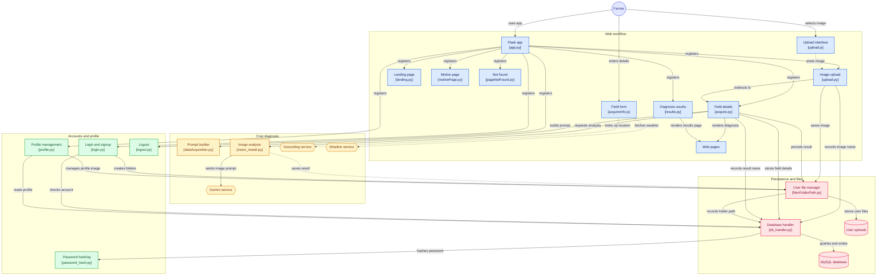

# Kisan-Mitr

```mermaid
%% Generated by https://gitdiagram.com/ashutoshdebug/kisan-mitr
flowchart TD

subgraph group_web["Web workflow"]
  node_flask["Flask app<br/>[app.py]"]
  node_upload_route["Image upload<br/>[upload.py]"]
  node_acquire_route["Field details<br/>[acquire.py]"]
  node_result_route["Diagnosis results<br/>[results.py]"]
  node_web_pages["Web pages"]
  node_upload_ui["Upload interface<br/>[upload.js]"]
  node_field_ui["Field form<br/>[acquireInfo.js]"]
  node_landing_route["Landing page<br/>[landing.py]"]
  node_motive_route["Motive page<br/>[motivePage.py]"]
  node_notfound_route["Not found<br/>[pageNotFound.py]"]
end

subgraph group_diagnosis["Crop diagnosis"]
  node_prompt["Prompt builder<br/>[dataAcquisition.py]"]
  node_vision["Image analysis<br/>[vision_model.py]"]
  node_gemini{{"Gemini service"}}
  node_geocoder{{"Geocoding service"}}
  node_weather{{"Weather service"}}
end

subgraph group_accounts["Accounts and profile"]
  node_login_route["Login and signup<br/>[login.py]"]
  node_profile_route["Profile management<br/>[profile.py]"]
  node_logout_route["Logout<br/>[logout.py]"]
  node_password["Password hashing<br/>[password_hash.py]"]
end

subgraph group_persistence["Persistence and files"]
  node_db_handler["Database handler<br/>[db_handler.py]"]
  node_mysql[("MySQL database")]
  node_file_manager["User file manager<br/>[filenFolderPath.py]"]
  node_user_files[("User uploads")]
end

node_farmer(("Farmer"))

node_farmer -->|"uses app"| node_flask
node_flask -->|"registers"| node_landing_route
node_flask -->|"registers"| node_login_route
node_flask -->|"registers"| node_logout_route
node_flask -->|"registers"| node_motive_route
node_flask -->|"registers"| node_notfound_route
node_flask -->|"registers"| node_profile_route
node_flask -->|"registers"| node_result_route
node_flask -->|"registers"| node_acquire_route
node_flask -->|"registers"| node_upload_route
node_farmer -->|"selects image"| node_upload_ui
node_upload_ui -.->|"posts image"| node_upload_route
node_upload_route -->|"saves image"| node_file_manager
node_upload_route -->|"records image name"| node_db_handler
node_upload_route -->|"redirects to"| node_acquire_route
node_farmer -->|"enters details"| node_field_ui
node_field_ui -.->|"looks up location"| node_geocoder
node_field_ui -.->|"fetches weather"| node_weather
node_acquire_route -->|"builds prompt"| node_prompt
node_acquire_route -->|"stores field details"| node_db_handler
node_acquire_route -->|"requests analysis"| node_vision
node_vision -->|"sends image prompt"| node_gemini
node_vision -.->|"saves result"| node_file_manager
node_acquire_route -->|"persists result"| node_file_manager
node_acquire_route -->|"records result name"| node_db_handler
node_acquire_route -->|"renders diagnosis"| node_web_pages
node_result_route -->|"renders results page"| node_web_pages
node_login_route -->|"checks account"| node_db_handler
node_login_route -->|"creates folders"| node_file_manager
node_db_handler -->|"hashes password"| node_password
node_profile_route -->|"reads profile"| node_db_handler
node_profile_route -->|"manages profile image"| node_file_manager
node_db_handler -->|"queries and writes"| node_mysql
node_file_manager -->|"stores user files"| node_user_files
node_file_manager -->|"records folder path"| node_db_handler

click node_flask "https://github.com/ashutoshdebug/kisan-mitr/blob/main/app.py"
click node_upload_route "https://github.com/ashutoshdebug/kisan-mitr/blob/main/routes/upload.py"
click node_acquire_route "https://github.com/ashutoshdebug/kisan-mitr/blob/main/routes/acquire.py"
click node_result_route "https://github.com/ashutoshdebug/kisan-mitr/blob/main/routes/results.py"
click node_web_pages "https://github.com/ashutoshdebug/kisan-mitr/tree/main/templates"
click node_upload_ui "https://github.com/ashutoshdebug/kisan-mitr/blob/main/static/js/upload.js"
click node_field_ui "https://github.com/ashutoshdebug/kisan-mitr/blob/main/static/js/acquireInfo.js"
click node_prompt "https://github.com/ashutoshdebug/kisan-mitr/blob/main/engine/dataAcquisition.py"
click node_vision "https://github.com/ashutoshdebug/kisan-mitr/blob/main/engine/vision_model.py"
click node_login_route "https://github.com/ashutoshdebug/kisan-mitr/blob/main/routes/login.py"
click node_profile_route "https://github.com/ashutoshdebug/kisan-mitr/blob/main/routes/profile.py"
click node_logout_route "https://github.com/ashutoshdebug/kisan-mitr/blob/main/routes/logout.py"
click node_password "https://github.com/ashutoshdebug/kisan-mitr/blob/main/utils/password_hash.py"
click node_db_handler "https://github.com/ashutoshdebug/kisan-mitr/blob/main/database/db_handler.py"
click node_file_manager "https://github.com/ashutoshdebug/kisan-mitr/blob/main/utils/filenFolderPath.py"
click node_user_files "https://github.com/ashutoshdebug/kisan-mitr/tree/main/static/uploads/database"
click node_landing_route "https://github.com/ashutoshdebug/kisan-mitr/blob/main/routes/landing.py"
click node_motive_route "https://github.com/ashutoshdebug/kisan-mitr/blob/main/routes/motivePage.py"
click node_notfound_route "https://github.com/ashutoshdebug/kisan-mitr/blob/main/routes/pageNotFound.py"

classDef toneNeutral fill:#f8fafc,stroke:#334155,stroke-width:1.5px,color:#0f172a
classDef toneBlue fill:#dbeafe,stroke:#2563eb,stroke-width:1.5px,color:#172554
classDef toneAmber fill:#fef3c7,stroke:#d97706,stroke-width:1.5px,color:#78350f
classDef toneMint fill:#dcfce7,stroke:#16a34a,stroke-width:1.5px,color:#14532d
classDef toneRose fill:#ffe4e6,stroke:#e11d48,stroke-width:1.5px,color:#881337
classDef toneIndigo fill:#e0e7ff,stroke:#4f46e5,stroke-width:1.5px,color:#312e81
classDef toneTeal fill:#ccfbf1,stroke:#0f766e,stroke-width:1.5px,color:#134e4a
class node_flask,node_upload_route,node_acquire_route,node_result_route,node_web_pages,node_upload_ui,node_field_ui,node_landing_route,node_motive_route,node_notfound_route toneBlue
class node_prompt,node_vision,node_gemini,node_geocoder,node_weather toneAmber
class node_login_route,node_profile_route,node_logout_route,node_password toneMint
class node_db_handler,node_mysql,node_file_manager,node_user_files toneRose
class node_farmer toneIndigo
```